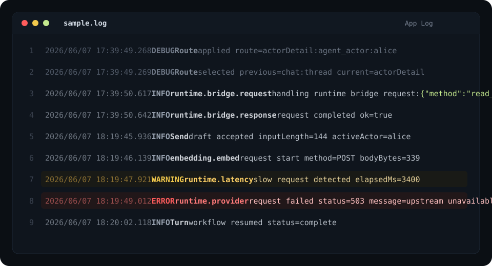

# Log Observer Theme

Dark and light Zed themes optimized for reading structured application logs.



## Companion Language Extension

This extension provides the `Log Observer Dark` and `Log Observer Light` themes. For the log-specific highlighting shown above, also install [Log Observer](https://github.com/worldtheater/log-observer).

The theme can be used on its own, but the `App Log` grammar and log-specific syntax captures come from the companion language extension.

## Installation

After this extension is published to Zed, install `Log Observer Theme` from the Zed extensions panel.

For the full log reading experience, install both extensions:

- `Log Observer`
- `Log Observer Theme`

## Themes

- Log Observer Dark
- Log Observer Light

## Development

Install this repository with `zed: install dev extension`, then select `Log Observer Dark` or `Log Observer Light` from the theme picker.

To test the highlighted log captures locally, also install the language repository with `zed: install dev extension`:

```text
/Users/anux/repos/zed_plugins/log-observer
```
